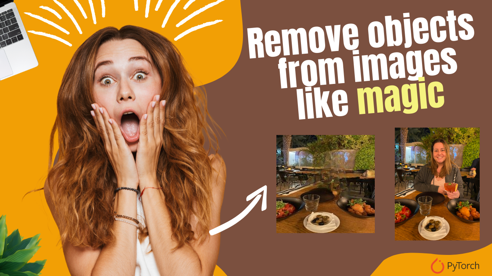

# Remove Objects from Images Like Magic – Step-by-Step Guide

  

##
   

Automated object remover Inpainter is a project that combines Semantic segmentation and EdgeConnect architectures with minor changes in order to remove specified objects from photos. For Semantic Segmentation, the code from Pytorch has been adapted, whereas for EdgeConnect, the code has been adapted from

This project is capable of removing objects from list of 20 different ones. It can be used as photo editing tool as well as for Data augmentation.
   
What you’ll learn:

* How to install the environment and the required Python libraries
* How to remove one object out of an image 
* How to remove several objects 

 

You can find the link for the [tutorial](https://youtu.be/GmqsPQNBScA) here. 

You can find more cool Object Detection projects and tutorials in this  [playlist](https://www.youtube.com/playlist?list=PLdkryDe59y4ZW-E59KQYegP5dr1WYnbpn)

You can find more computer vision tutorials in my blog page : https://eranfeit.net/blog/

Enjoy

Eran
   

# Recommended courses and relevant products 

🚀 Want to get started with Computer Vision or take your skills to the next level ? 

If you’re just beginning, I recommend this step-by-step course designed to introduce you to the foundations of Computer Vision - [Complete Computer Vision Bootcamp With PyTorch & TensorFlow](https://trk.udemy.com/9LoE7E) 

If you’re already experienced and looking for more advanced techniques, check out this deep-dive course - [Modern Computer Vision GPT, PyTorch, Keras, OpenCV4](https://trk.udemy.com/EEDyMD)

Before we continue , I actually recommend this [book](https://amzn.to/3STWZ2N) for deep learning based on Tensorflow and Keras : 

# Connect

If you have any suggestions about papers, feel free to mail me :)

- [☕ Buy me a coffee](https://ko-fi.com/eranfeit)
- [🌐 My Website](https://eranfeit.net)
- [▶️ Youtube.com/@eranfeit](https://www.youtube.com/channel/UCTiWJJhaH6BviSWKLJUM9sg)
- [🐙 Facebookl](https://www.facebook.com/groups/3080601358933585)
- [🖥️ Email](mailto:feitgemel@gmail.com)
- [🐦 Twitter](https://twitter.com/eran_feit )
- [😸 GitHub](https://github.com/feitgemel)
- [📸 Instagram](https://www.instagram.com/eran_feit/)
- [🤝 Fiverr ](https://www.fiverr.com/s/mB3Pbb)
- [📝 Medium ](https://medium.com/@feitgemel)

