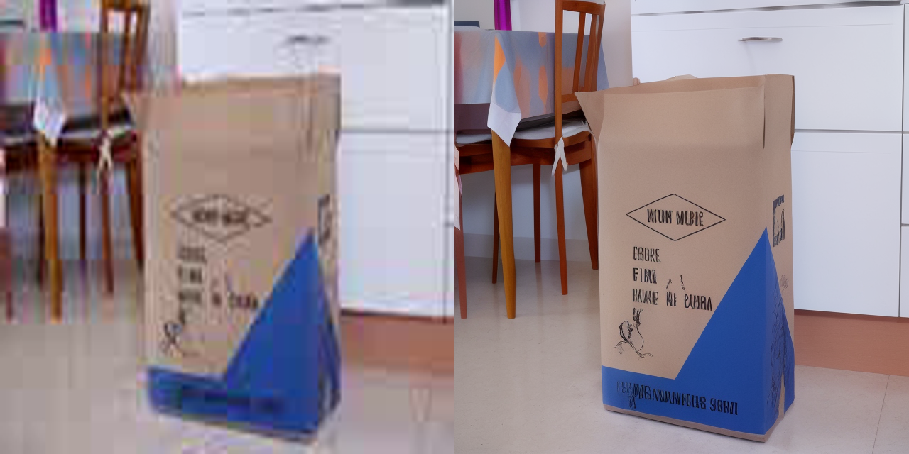
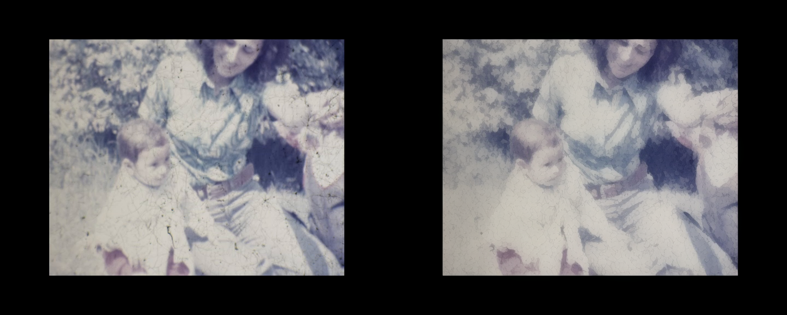

# Super Resolution | What if there was a tool that could enhance old Video to a FULL HD ?

  

##
   

Do you have old videos that you wish looked better? 
In this video I'm going to show you how to restore the quality of your old videos Video Enhancer free AI tool 

This process is really simple and easy, But you need a high GPU card , and patience for the transformation. 

This tutorial based on DiffIR2VR-Zero: Zero-Shot Video Restoration with Diffusion-based Image Restoration Models

   
What you’ll learn:

* How to install the environment and the required Python libraries
* How to enhance videos , How to make improve the resolution ?
* How to denoise videos , and make them more clear ?

 

You can find the link for the [tutorial](https://youtu.be/McJzFHLS3bE) here. 

You can find more cool Object Detection projects and tutorials in this  [playlist](https://www.youtube.com/playlist?list=PLdkryDe59y4ZW-E59KQYegP5dr1WYnbpn)

You can find more computer vision tutorials in my blog page : https://eranfeit.net/blog/

Enjoy

Eran
   

# Examples :

  
  
  

# Recommended courses and relevant products 

🚀 Want to get started with Computer Vision or take your skills to the next level ? 

If you’re just beginning, I recommend this step-by-step course designed to introduce you to the foundations of Computer Vision - [Complete Computer Vision Bootcamp With PyTorch & TensorFlow](https://trk.udemy.com/9LoE7E) 

If you’re already experienced and looking for more advanced techniques, check out this deep-dive course - [Modern Computer Vision GPT, PyTorch, Keras, OpenCV4](https://trk.udemy.com/EEDyMD)

Before we continue , I actually recommend this [book](https://amzn.to/3STWZ2N) for deep learning based on Tensorflow and Keras : 

# Connect

If you have any suggestions about papers, feel free to mail me :)

- [☕ Buy me a coffee](https://ko-fi.com/eranfeit)
- [🌐 My Website](https://eranfeit.net)
- [▶️ Youtube.com/@eranfeit](https://www.youtube.com/channel/UCTiWJJhaH6BviSWKLJUM9sg)
- [🐙 Facebookl](https://www.facebook.com/groups/3080601358933585)
- [🖥️ Email](mailto:feitgemel@gmail.com)
- [🐦 Twitter](https://twitter.com/eran_feit )
- [😸 GitHub](https://github.com/feitgemel)
- [📸 Instagram](https://www.instagram.com/eran_feit/)
- [🤝 Fiverr ](https://www.fiverr.com/s/mB3Pbb)
- [📝 Medium ](https://medium.com/@feitgemel)

